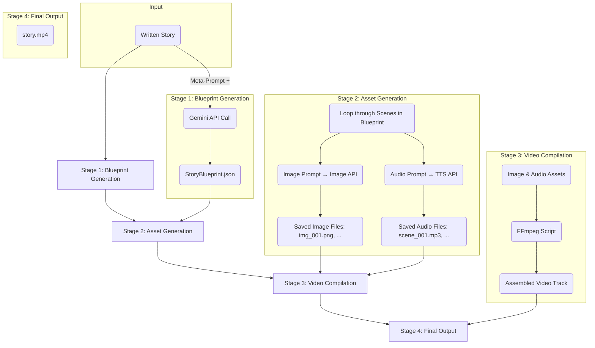

# AI Storyteller: From Prose to Cinematic Video


Transform any written story into a complete, narrated video. This project leverages the power of Large Language Models (LLMs) and other generative AI to analyze prose, create a detailed screenplay blueprint, generate all visual and audio assets, and compile them into a final video narrative.

## Table of Contents

1.  [Overview](#overview)
2.  [How It Works: The Four-Stage Pipeline](#how-it-works-the-four-stage-pipeline)
3.  [Core Technology Stack](#core-technology-stack)
4.  [The JSON Blueprint](#the-json-blueprint)
5.  [Prerequisites](#prerequisites)
6.  [Installation & Setup](#installation--setup)
7.  [Configuration](#configuration)
8.  [Usage](#usage)
9.  [Project Structure](#project-structure)
10. [Future Development](#future-development)
11. [Contributing](#contributing)
12. [License](#license)

## Overview

The goal of the AI Storyteller is to automate the incredibly complex process of converting a simple text-based story into a rich, visual medium. It acts as a director, cinematographer, casting agent, and editor, all driven by code.

You provide a piece of prose, and the system outputs a `.mp4` video file, complete with scenes, characters, and narration, ensuring visual consistency throughout.

### Key Features

- **Intelligent Story Analysis**: Uses the Gemini API to understand plot, characters, and setting.
- **Structured Screenplay Generation**: Creates a robust JSON "blueprint" that serves as the single source of truth for the entire video production.
- **Consistent Character Visualization**: Generates a master character reference sheet and uses it to maintain character consistency across all scenes.
- **Multi-Modal Asset Generation**: Programmatically generates scene images and voice audio for every part of the story.
- **Automated Video Compilation**: Stitches all generated assets into a final video file with correct timing.

## How It Works: The Four-Stage Pipeline

The project operates on a sequential, four-stage pipeline. The output of each stage is the input for the next.



1.  **Stage 1: Blueprint Generation**

    - The input prose is combined with a sophisticated "meta-prompt" that instructs the Gemini AI to act as a "Story-to-Screenplay Architect".
    - Gemini analyzes the story and returns a highly structured `StoryBlueprint.json` file, detailing all characters, settings, and sequential scenes with specific prompts for image and audio generation.

2.  **Stage 2: Asset Generation**

    - The program parses the `StoryBlueprint.json`.
    - It iterates through the `scenes` array. For each scene:
      - The `image_prompt` is sent to an image generation API (e.g., Gemini's own image generation, Stability AI) to create and save a visual for that scene.
      - The `audio_prompt` is sent to a Text-to-Speech (TTS) API (e.g., Google Cloud TTS, ElevenLabs) to generate and save the narration or dialogue.

3.  **Stage 3: Video Compilation**

    - With all image and audio assets saved locally, a video compilation script (using a library like `fluent-ffmpeg`) is invoked.
    - For each scene, the script takes the generated image and lays the corresponding audio track over it. The duration of the image on screen is determined by the length of the audio clip.

4.  **Stage 4: Final Output**
    - The final compiled video is saved as a `.mp4` file, ready for viewing.

## Core Technology Stack

- **Language**: TypeScript
- **Runtime**: Node.js
- **Package Manager**: [Yarn](https://yarnpkg.com/)
- **Blueprint Generation**: Google Gemini API (`@google/generative-ai`)
- **Image Generation**: Any API-accessible model (e.g., Gemini, Stability AI, Midjourney)
- **Audio Generation**: Any API-accessible TTS service (e.g., Google Cloud TTS, ElevenLabs)
- **Video Compilation**: [FFmpeg](https.ffmpeg.org/) (via a Node.js wrapper like `fluent-ffmpeg`)

## The JSON Blueprint

The `StoryBlueprint` is the heart of this project. It is the structured data that bridges the gap between creative prose and programmatic execution.

<details>
<summary>Click to view the full JSON schema</summary>

```json
{
  "project_name": "The Moonpetal's Light",
  "story_prose": "The encroaching gloom was not a shadow...",
  "screenplay": {
    "title": "Whisperwood's Hope",
    "logline": "A quiet village herbalist ventures into a cursed forest...",
    "characters": [
      {
        "character_id": "char_001",
        "name": "Elara",
        "description": "A young woman, a quiet and determined gatherer of herbs...",
        "is_narrator": false
      }
    ],
    "scenes": [
      {
        "scene_id": "scene_001",
        "setting_description": "The edge of a desolate village...",
        "image_prompt": {
          "prompt_type": "initial_character_generation",
          "description": "Generate a cinematic, full-body visual representation of the main character, Elara...",
          "required_character_ids": ["char_001"],
          "required_image_ids": [],
          "output_image_id": "img_001"
        },
        "audio_prompt": {
          "character_id": "narrator_001",
          "dialogue": "The encroaching gloom was not a shadow, but an absence...",
          "voice_style": "somber, deep, and measured"
        }
      }
    ]
  }
}
```

</details>

## Prerequisites

Before you begin, ensure you have the following installed:

- [Node.js](https://nodejs.org/en/) (v18 or later)
- [Yarn Package Manager](https://yarnpkg.com/getting-started/install)
- [FFmpeg](https://ffmpeg.org/download.html) - **Must be installed and accessible from your system's PATH.**

You will also need API keys for the services you intend to use:

- Google AI (for Gemini)
- An image generation service
- A Text-to-Speech (TTS) service

## Installation & Setup

1.  **Clone the repository:**

    ```bash
    git clone https://github.com/your-username/ai-storyteller.git
    cd ai-storyteller
    ```

2.  **Install dependencies using Yarn:**
    ```bash
    yarn install
    ```

## Configuration

This project uses environment variables to manage API keys and other settings.

1.  **Create a `.env` file** in the root of the project by copying the example file:

    ```bash
    cp .env.example .env
    ```

2.  **Edit the `.env` file** with your API keys and desired settings.

## Usage

To run the application, first ensure your `package.json` has a `start` script defined, for example:

```json
// package.json
"scripts": {
  "start": "ts-node src/app.ts"
},
```

1.  **Open the main application file**: `src/app.ts`.
2.  **Locate the main execution logic** where the input story is defined.
3.  **Insert your story** into the designated variable.
4.  **Run the script from your terminal:**
    `bash
yarn start
`
    The script will now execute the full pipeline. You will see log messages in your console as it moves through each stage. The final video will be saved in your designated output directory.

## Project Structure

```
/ai-storyteller
├── .yarn/
├── node_modules/
├── src/
│   ├── assets/
│   ├── data/
│   │   └── index.ts
│   ├── handlers/
│   │   └── index.ts
│   ├── helpers/
│   │   └── index.ts
│   ├── typings/
│   │   └── index.ts
│   ├── utilities/
│   │   └── index.ts
│   └── app.ts
├── .editorconfig
├── .env
├── .env.example
├── .eslintrc.json
├── .gitattributes
├── .gitignore
├── .yarnrc.yml
├── Dockerfile
├── LICENSE
├── nodemon.json
├── package.json
├── README.md
├── register.js
├── tsconfig.json
└── yarn.lock
```

## Future Development

This project has a wide scope for future improvements:

- [ ] **Advanced Video Editing**: Implement transitions (fades, wipes) between scenes instead of hard cuts.
- [ ] **Background Music/Ambiance**: Add another track for background music or ambient sounds based on scene descriptions.
- [ ] **Improved Character Consistency**: Integrate techniques like LoRA models for even more consistent character generation.
- [ ] **Web Interface**: Build a simple front-end where users can paste their story and see the video being generated.
- [ ] **CLI Arguments**: Allow passing the story via a file path or direct argument instead of editing the source code.

## Contributing

Contributions are welcome! If you have ideas for new features or improvements, please open an issue to discuss it first. Pull requests should be well-documented and follow the existing code style.

## License

This project is licensed under the MIT License. See the `LICENSE` file for details.
